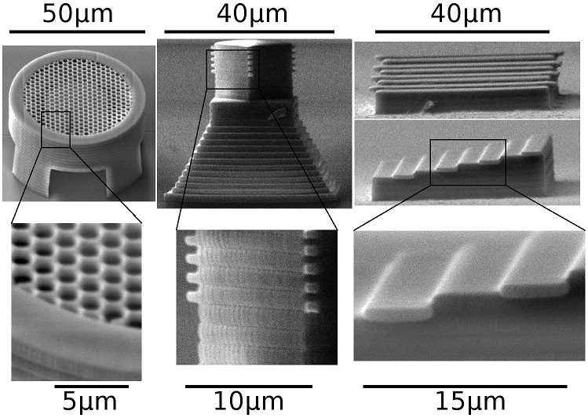
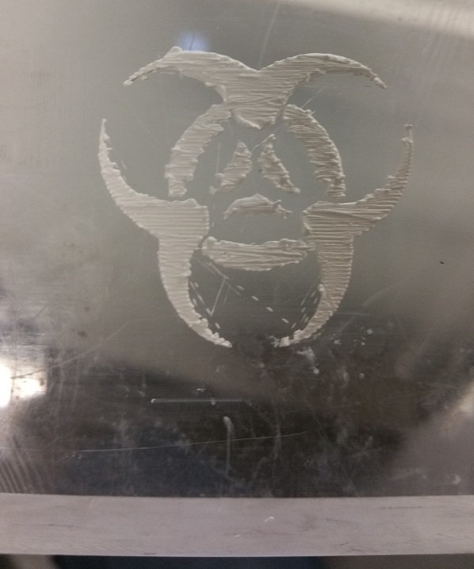

# MLM: Multiresolution Layered Manufacturing #

*UPDATE*: you can read a paper about some of this work [here](MLM.pdf) or in the [journal](https://www.emeraldinsight.com/doi/abs/10.1108/RPJ-07-2017-0146).

 

This is the MLM (Multiresolution Layered Manufacturing) metaproject. Its purpose is to set up together and compile several software projects to generate the MLM toochain. This toolchain enables Multiresolution Layered Manufacturing, a new approach to hybrid manufacturing (considering both additive and subtractive processes). Conventional slicing software for 3D printers considers a single voxel size when generating the toolpaths to manufacture a 3D object. MLM can slice a 3D object considering not one but several voxel sizes and shapes, so that the bulk of the object is manufactured with big-voxel toolpaths and the high-resolution details are manufactured with small-voxel toolpaths. Of course, this means that you need either a technology able to print with several voxel sizes, or use several technologies together (commonly called *hybrid manufacturing*).

## Some examples

Some examples to understand the capabilities of the MLM toolchain. The descriptions are succint; see the rest of the README for more information. The software is designed to be generic, so it can slice for many different manufacturing technologies. So far, it has been tested with stereolithography by TPP (two-photon polymerization, example 1), hybrid machining with a spindle and an ablative laser (example 3), and paste extrusion with several extrusion heads (example 4).

---

### Example 1: Microscopic structures manufactured with a Nanoscribe 3D printer

Several 3D objects:


Toolpaths for several different voxel files generated by MLM (with some tweaking in the case of the tower). Red toolpaths are for big voxels, green toolpaths for small voxels:


Results imaged with an electronic microscope:



Special thanks to Sam Dehaeck, Youen Vitry and Pierre Lambert for their assistance in using the Nanoscribe 3D printer in the BEAMS laboratory.

---

### Example 2: Simple 3D object, simple configurations, no actual manufacturing

Simple 3D object:


Naive configuration with two voxel sizes (voxels are cilindrical, differing in radius and height), both for additive manufacturing. Red toolpaths are for big voxels, green toolpaths for small voxels:


Naive configuration with two voxel sizes, the bigger one for additive manufacturing, the smaller one for subtractive manufacturing, note how some parts are too thin for the big voxels, but they are written anyway, and then the subtractive process at higher resolution just removes whatever should not be part of the shape. Red toolpaths are for big voxels, green toolpaths for small voxels:


---

### Example 3: Similar simple 3D object, subtractive configuration (machining with spindle and laser)

Configuration for a similar (thinner) object, with two voxel sizes, both for subtractive manufacturing. The bigger voxel (red toolpaths) has a custom shape to match a precision spindle, the smaller one (green toolpaths) is for high-precision laser machining:


Results from applying the previous toolpaths both with the spindle and the laser (not very good because of alignment issues):


Special thanks to Otec for the chance to use their high-precision machining systems.

---

### Example 4: Simple similar 3D object, additive configuration (3D printer with several interchangeable heads)

Configuration for a similar object (with dented surface), with two voxel sizes, both for additive manufacturing. The voxels are configured to match the ones available from a high-precision 3D printer for gels and ceramic paste. The 3D printer is driven by Slic3r-generated gcode.

Results with gel:


Results with ceramic paste:



Special thanks to Eduardo Saiz for being able to use his lab's 3D printer, and to Ezra Feilden-Irving for taking the time and effort to execute these proofs of concept. These images are used with his permission.

---

## Output formats

Depending on what elements are compiled, the MLM toolchain can output toolpaths in several formats:

* PATHS files: MLM's own custom binary format, simple and fast, ideal for inspection and processing within the MLM toolchain.
* DXF files containing PolyLines.
* GWL scripts (for 3D printers from Nanoscribe)
* Gcode generated with a modified version of Slic3r.
* as PolyLines in AutoCAD.

The PATHS file format directly supports toolpaths with different voxel sizes. But, how do you combine toolpaths meant for different voxel sizes in other formats?

* In DXF, this is achieved separating the toolpaths for each voxel size in a different file.
* In GWL, the toolpaths can be either in different files (then, it will be the responsibility of the user to modify and use them adequately in a printing session) or in a single file (then, the different sizes must be configured with some suitable sequence of GWL commands).
* In gcode, the machine must support multiple printing heads, and Slic3r must be used with a .ini file configured to use them.
* In the AutoCAD plugin, toolpaths for different voxel sizes have different colors.

## Subprojects

The MLM toolchain is composed of the following subprojects:

* [multiresolution](https://github.com/jdfr/multiresolution): the core subproject of the MLM toolchain, containing:
  * the multislicing engine, which uses 2D contours generated by Slic3r and generates toolpaths for multiple voxel types. This engine can be used in two forms:
    * a fully-featured command-line executable. It can output in several formats: PATHS, DXF, and Nanoscribe's GWL, with several features to help the output to be used for different hybrid manufacturing processes.
    * a shared library with most but not all of the features, but able to be integrated with other software projects (in particular, its API is set up so it can be fed slices from any other sources, while the executable is hardwired to use Slic3r, and it can accept feedback to correct errors and deviations from the intended shape).
  * A C# plugin for AutoCAD as an example on how to use the shared library.
  * A series of utilities to process toolpaths in the PATHS format (and also process point clouds and generate SVGs).
* [Slic3r](https://github.com/jdfr/Slic3r): a patched version of [Slic3r](https://github.com/alexrj/Slic3r), used for two purposes:
  * To read 3D objects from STL files and slice 2D contours from them. This is an integral part of the MLM toolchain, used by the core subproject. In this form, Slic3r's library is compiled as a C++ command-line application that communicates with the parent process over stdin and stdout. Other simple command-line tools using Slic3r's code are provided, (a) to get the bounding box of a mesh and (b) to translate a mesh.
  * To convert PATHS files to gcode. This is optional, and requires a significantly more involved setup, as a fully-fledged version of Slic3r has to be compiled.
* [pyclipper](https://github.com/jdfr/pyclipper): while originally MLM started as a suite of Python and Cython scripts, for various reasons it evolved into C++ and the pythonic part atrophied to a handful of utilities:
  * slicesViewer.py: a simple 2D/3D viewer for PATHS files
  * contourViewer.py: a simple PolyLine viewer for debugging purposes
  * cloudmesh.py: a script to process 2.5D point clouds into 3D heightmaps stored as STL files.
  * mergestls.py: a script to blindly merge several STL files into a single one.
* [cork](https://github.com/jdfr/cork): As most other instances of slicing software (in fact, because it uses third-party software to digest STL files!), MLM struggles when processing very large 3D meshes. [cork](https://github.com/gilbo/cork) is a library to accurately perform boolean operations on very large 3D meshes. MLM is prepared so it can be used together with cork to partition the large 3D meshes into smaller portions, and then slice all of them together. In this way, very large meshes that crash other slicers can be processed by MLM.
* [clipper](https://github.com/jdfr/clipper): a patched version of [ClipperLib](http://www.angusj.com/delphi/clipper.php), used to implement boolean operations on 2D contours. The patches are mostly to read/write PATHS files and use a custom allocator to increase performance. 
* [data_test](https://github.com/jdfr/data_test): a subproject containing STLs used for testing and demonstration purposes.

While the ideal way to develop might be to use some sort of system to keep track of which versions of each subproject are in sync (for example, git submodules), for now the projects are entirely separated repositories, and the MLM metaproject just pulls them wholesale, being the responsibility of the programmer to keep them (as well as MLM's `CMakeLists.txt`) in sync.

The cork subproject is forked directly from the original, which has not been maintained for several years, but has quite a lot of forks, some of which exchange commits, suggesting a user community (good, open source 3D boolean engines are hard to come by...). Clipper is now very mature; it is still maintained, but bugfixes are few and far between (this is good, because the version used in MLM is heavily patched...). Finally, Slic3r is directly forked from the original, and is also somewhat heavily patched. As the original project is still undergoing strong development with frequent and deep changes to the codebase, merging new commits from the original should be done with extreme attention to detail, by someone familiar with the changeset. The other subprojects are original.
 
## Platforms

MLM has been compiled in Linux and Windows (MinGW/Visual Studio). Compilation in OSX should be possible, either with a GNU toolchain or modifying the `CMakeLists.txt` files of each subproject to add support for XCode builds.

All subprojects are meant to be compiled for 64 bit systems, and the PATHS file format assumes little-endianess.

## Compiling

The list of dependencies varies according to what parts you will need:

* In general: Boost 1.55+ and CMake 3.3.X+; and one or more (mostly compliant) C++11 compilers. The core subproject has been compiled with Visual Studio 2013+ or gcc/MinGW64 5.X, but recent versions of Slic3r require gcc/MinGW 6.X. It should be possible to compile the core subproject with other compilers such as clang, but I have not tried it.
* For the AutoCAD plugin: you will need AutoCAD 2013+ (obviously) and the ObjectARX version matching AutoCAD's version, as well as a Visual Studio version supporting the same version of .NET as the one supported by that version of AutoCAD.
* For Slic3r: if you want to convert the output to gcode with Slic3r, you will need Perl 5.X (see Slic3r's wiki for details), otherwise it is not necessary.
* For cork: you will need GMP and Clang, if your version of gcc is 5.X (gcc 6.X can compile cork without problems).
* For pyclipper: x64 versions of Python 2/3 (more tested on 2 than 3, though), Cython, Numpy, and Scipy. For 2D viewing, Matplotlib. For 3D viewing, Mayavi. Assembling all of these packages in Windows might not be trivial, especially if you want to include Mayavi. I have done it with WinPython64 and Gohlke's informal repository; in other python distros it might be easier. See pyclipper for details.

In Linux, you will just need to do something like this to compile all binaries in `../bin`:

```bash
cd ..
mkdir build
cd    build
cmake -D ALL_OUTPUT_DIR="../bin" ..
make
```

The build process is somewhat involved and uses at least one `CMakeLists.txt` per subproject, with lots of configurable options. For example, if you do not want to generate gcode, it is best to skip the compilation of Slic3r (really slow, needlessly repetitive and prone to crash the build process), adding ` -D BUILD_SLIC3RPERL=OFF ` to cmake's command line BEFORE the final `..`. There are lots of other build options, as using gcov/lcov for code coverage analysis; these are in the respective `config.cmake` and `CMakeLists.txt` build files in each project.

In Windows... You should start the same as in Linux: 

```bash
cd ..
mkdir build
cd    build
```

But now, before calling cmake... It's complicated! What do you exactly need? Do you have system-wide Perl and Python installations? Might one or both of them be self-contained, like WinPython or CitrusPerl, and they require launching custom cmd prompts? (If both are system-wide, you better have them use exactly the same version of MinGW...) Will you compile the core subproject with MinGW (which one?), or Visual Studio? In Windows 10, WSL might make things simpler, but if you want the AutoCAD plugins, you probably should not use it...  Anyway, depending on your configuration, you will need to add lots of parameters to cmake's command line (all before the final `..`):

* `-G "your main generator"`: cmake is a metabuild system, it generates build systems for many different setups. This should be a generator for MinGW or Visual Studio (check the ones you need in the output of `cmake --help`), you can use either, but keep in mind that by default the generator for each subproject will be this one, but you might have to change it because Slic3r MUST be compiled in MinGW, and the AutoCAD plugin MUST be compiled in Visual Studio. Thus, depending on the option you choose here, you might need to set other options for the generators of these subsystems.
* `-D ALL_OUTPUT_DIR="../bin"`: this is the same as in Linux, makes all binaries to be compiled into `../bin`
* `-D BOOST_ROOT_PATH=your_boost_root_path`: this can be the path to a source version of Boost, or the root path to include Boost headers.
* `-D COMPILE_PROGRAMOPTIONS=on/off`: if you have Boost's sources, you can compile boost::program_options for the core subproject (multiresolution), or use a precompiled library. The former is useful if you want to compile the core subproject in Visual Studio but you want to avoid waiting gazillions years for all of Boost to compile, or avoid having several binary versions of Boost, one for Visual Studio and the other for MinGW (Slic3r *requires* Boost binaries, while the core subproject can either use them or compile the library from source).
* `-D GENERATOR_MULTIRES="your generator"`: this is the build system to use for the core subproject (multiresolution), use `cmake --help to check the generators, you can use one for MinGW or Visual Studio, depending on what is installed on your system`.
* `-D GENERATOR_MULTIRES_CS="your VS generator"`: cmake will happily generate build targets for visual studio, but you have to tell it which version to use. Available generators are listed in the output of `cmake --help`. This has to be set to some Visual Studio version if you are using MinGW for the core subproject.
* `-D MAKEMR_CS_INTERFACE=on/off`: disable if you do not want to build the example AutoCAD plugin.
* `-D AUTOCAD_PATH_PREFIX=your_autocad_path`: if building the AutoCAD plugin, this must be the path to your AutoCAD installation directory.
* `-D PYTHON_EXECUTABLE=path_to_python`: if you want pyclipper and your python distro is not system-wide, this must be the path to the python executable.
* `-D -D PYTHON_EXECUTABLE_FOR_SETUP=path_to_python_setup`: some distros, such as WinPython, require setup steps (like pip) to be performed from a custom command line environment *different* from the one used to run regular python.
* `-D Boost_USE_STATIC_LIBS=on/off`: by default this is off, but newer versions of recipes to compile Slic3r in Windows guide you to link Boost statically, so you should compile Boost that way, and then set this to on. 

After configuring cmake's command line, you should save it in a .bat script, to recompose the build system in the same way every time you need it. The build process itself can be launched after cmake is done with the configuration, with `cmake --build . --config Release` (this will spare you to remember if you have to use MinGW's make or launch a Visual Studio build).

Let's say, for example, that you compile everything in MinGW (opting out of the AutoCAD plugin, of course), you use a self-contained WinPython v.2.7.10 in `c:\winpython` and a system-wide version of Strawberry Perl (the one, in fact, required by Slic3r!), and you have compiled Boost with the MinGW shipped in Strawberry Perl in `c:\boost`. Then, you invocation to cmake can be like this:

`cmake -G "MinGW Makefiles" -D BOOST_ROOT_PATH="C:/boost" -D COMPILE_PROGRAMOPTIONS=off -D ALL_OUTPUT_DIR="../bin" -D PYTHON_EXECUTABLE="c:/winpython/python-2.7.10.amd64/python.exe" -D PYTHON_EXECUTABLE_FOR_SETUP="c:/winpython/WinPython Interpreter.exe" -DBUILD_SLIC3RPERL=ON -DBoost_USE_STATIC_LIBS=ON ..`

Now, let's say that you want as much as possible compiled with Visual Studio 2015, including the AutoCAD plugin (you also have, let's say, AutoCAD 2013 and the corresponding ObjectARX), but you do not want Slic3r to convert from PATHS to gcode files. Then, you can use the following:

`cmake -G "MinGW Makefiles" -D BOOST_ROOT_PATH="C:/boost" -D COMPILE_PROGRAMOPTIONS=on -D ALL_OUTPUT_DIR="../bin" -D MAKEMR_CS_INTERFACE=ON -D  GENERATOR_MULTIRES="Visual Studio 14 2015 Win64" -D AUTOCAD_PATH_PREFIX="C:\Program Files\Autodesk\AutoCAD 2013" -D PYTHON_EXECUTABLE="c:/winpython/python-2.7.10.amd64/python.exe" -D PYTHON_EXECUTABLE_FOR_SETUP="c:/winpython/WinPython Interpreter.exe" -DBUILD_SLIC3RPERL=OFF ..`

There are other configurations, and of course other build options. By the way, supporting all these different build configurations is the reason the build system is so involved, with nested cmake invocations using different build generators...

In Windows, it is possible to set up a Visual Studio solution for ease of development of the core subproject. If you do so, please remember to select as Target "x64", and use either "Release" or "Debug" as build type.

## Usage overview (very high-level)

The typical way to use the toolchain is:

* Select a STL file, and define the parameters to configurate the multislicing engine. The toolchain comes with some utilities to crudely transform a 2.5D point cloud into a heightmap in STL format.
* If the STL file is huge (millions of triangles), contour generation will be too slow. In that case, you can use the `splitter.exe` / `splitter`tool to define a partition grid, `cork` to actually perform the partition and the parameter `--load-multi` in the the main command line tool (`multires.exe` / `multires`) to do the slicing.
* Use the multislicing engine (either through the AutoCAD plugin or the main command line tool) to do the slicing. Save in the appropriate format. Depending on the task at hand and the manufacturing technologies (for example, printing a shape of 1cm with a TPP printer), it might make sense to configure the engine to slice many small, overlapping regions (the same principle as Nanoscribe's stitching).
* If the results were saved in a PATHS file `result.paths` and you built the pyclipper subproject (requires python), you can use `slicesViewer.bat example 2d file result.paths` in Windows or `./slicesViewer.sh example 2d file result.paths` in Linux to inspect the results. Substitute `2d` by `3d` to see the paths in 3d (requires mayavi). If the results are in other formats (DXF or GWL), use an appropriate application to open them. In `2d` mode, you can use the cursor arrows to navigate in Z, and zoom in and out to see small details.
* You can manipulate the resulting PATHS files with the command line utilities, if necessary.
* Afterwards, if you are going to print with a machine that accepts gcode, you need to convert the results in the PATHS files to gcode with the custom version of Slic3r, using a command line like this one: `perl slic3r.pl [other options] --import-paths result.paths x`. Make sure to read the usage notes from `perl slic3r.pl --help`.

## Using the command-line slicing engine

Just call the engine (`multires.exe` in Windows, `multires` in Linux) with the appropriate parameters. Basic help can be obtained with `--help`. The engine is highly configurable.

**TODO**: include a description about how to use the parameters to configure the engine.

## Using the shared-library slicing engine

It is mostly the same as from the command line, but the contours are fed through the API (so they can be generated in any way, they do not have to come from a STL file!), and the toolpaths are also received through the API, instead of directly written to a file. It also has the ability to accept feedback about the manufacturing process, in the form of actually manufactured contours that might not match (because of errors) the contours generated by the engine, and take them into account to compute new toolpaths. The AutoCAD plugin is a very bare-bones example on how to use the library (it actually feeds the library contours from Slic3r just as the command-line engine, instead of anything more sophisticated!).

## Using the AutoCAD plugin

After compiling everything you need:

* open AutoCAD
* open a document or create a new document
* execute the AutoCAD command NETLOAD, navigate to the directory where cmake was executed (usually the "bin" directory), and select the file AutoCADMulti.dll
* If the dll is successfully loaded, execute the AutoCAD command MULTISLICER.
* A window will appear over AutoCAD. You can enter slicing options very much like in the command line version.

## Testing

See the multiresolution subproject's README file.

## Examples

Once you have compiled everything you need, you will want some examples. Examples are generated by cmake in the subdirectory `bin/test`, each example being a file containing parameters for the slicing engine. They can be executed as `multires.exe --response-file test/TESTNAME`. Beware that the STLs must be copied/generated by tests configured to run earlier (you can run `cmake --build . --target putfiles --config Release` from the build directory to make sure to copy them). Most examples generate PATHS files (with the option --save), which can be viewed (if you have python and matplotlib) from the command line with `slicesViewer.bat example 2d file test\RESULT_FILE` in Windows and `./slicesViewer.sh example 2d file test/RESULT_FILE` in Linux. Substitute `2d` by `3d` to see the paths in 3d (requires mayavi). To see the results in other formats, first convert (to DXF, GWL or gcode), and then use a suitable application or utility. These PATHS files can also be loaded in AutoCAD with the plugin.

Here we also list some of these examples. Each example described here indicates a STL file from the data_test subproject and a sequence of parameters for the slicing engine. There are two ways to execute the multislicing engine:

* If you have AutoCAD and have compiled the plugin, you can execute the example from AutoCAD (see the section about how to use the plugin), pasting the slicing parameters in the dialog box.
* If you want to use the main tool (`multires.exe` in Windows, `multires` in Linux), you have to excute it from the command line. The slicing parameters are the same as in the previous case. The STL file is loaded with the parameter `--load "PATH_TO_STL_FILE"`. To view the results, the simplest thing is to add the parameters `--show 2d` or `--show 3d` (you'll need python with matplotlib or mayavi, respectively). To save the results as PATHS files, add `--save filename.paths`.

Most of the examples listed here are configured to do path clearance (i.e. make sure that paths do not overlap), but it can be turned off for technologies that do not require this.

* simplified (not true 3d), without infilling:
  * STL file: `full.stl`
  * parameters:
  ```
    --slicing-uniform 0.05 --save-contours --motion-planner --process 0 --radx 75 --gridstep 0.1 --tolerances 0.75 0.01 --smoothing 0.01 --safestep --snap --clearance --medialaxis-radius 1.0 --process 1 --radx 10 --gridstep 0.1 --tolerances 0.1 0.001 --smoothing 0.1 --safestep --snap --clearance --medialaxis-radius 1.0
  ```
    
* simplified (not true 3d), without infilling, removing redundant toolpaths at high resolution:
  * STL file: `full.stl`
  * parameters:
  ```
    --slicing-uniform 0.05 --save-contours --motion-planner --process 0 --radx 75 --gridstep 0.1 --tolerances 0.75 0.01 --smoothing 0.01 --safestep --snap --clearance --medialaxis-radius 1.0 --process 1 --radx 10 --gridstep 0.1 --tolerances 0.1 0.001 --smoothing 0.1 --radius-removecommon 0.1 --safestep --snap --clearance --medialaxis-radius 1.0
  ```
    
* simplified (not true 3d), concentric infilling:
  * STL file: `full.stl`
  * parameters:
  ```
    --slicing-uniform 0.05 --save-contours --motion-planner --process 0 --radx 75 --gridstep 0.1 --tolerances 0.75 0.01 --smoothing 0.01 --safestep --snap --clearance --medialaxis-radius 1.0 --infill concentric --infill-medialaxis-radius 0.5 --process 1 --radx 10 --gridstep 0.1 --tolerances 0.1 0.001 --smoothing 0.1 --safestep --snap --clearance --medialaxis-radius 1.0 --infill concentric --infill-medialaxis-radius 0.5
  ```

* simplified (not true 3d), line infilling:
  * STL file: `full.stl`
  * parameters:
  ```
    --slicing-uniform 0.05 --save-contours --motion-planner --process 0 --radx 75 --gridstep 0.1 --tolerances 0.75 0.01 --smoothing 0.01 --safestep --snap --clearance --medialaxis-radius 1.0 --infill linesh --infill-medialaxis-radius 0.5 --process 1 --radx 10 --gridstep 0.1 --tolerances 0.1 0.001 --smoothing 0.1 --safestep --snap --clearance --medialaxis-radius 1.0 --infill linesh --infill-medialaxis-radius 0.5
  ```
    
* simplified (not true 3d), concentric infilling at low resolution, line infilling at high resolution:
  * STL file: `full.stl`
  * parameters:
  ```
    --slicing-uniform 0.05 --save-contours --motion-planner --process 0 --radx 75 --gridstep 0.1 --tolerances 0.75 0.01 --smoothing 0.01 --safestep --snap --clearance --medialaxis-radius 1.0 --infill concentric --infill-medialaxis-radius 0.5 --process 1 --radx 10 --gridstep 0.1 --tolerances 0.1 0.001 --smoothing 0.1 --safestep --snap --clearance --medialaxis-radius 1.0 --infill linesh --infill-medialaxis-radius 0.5
  ```

* simplified (not true 3d), to show recursive infilling:
  * STL file: `full.stl`
  * parameters:
  ```
    --slicing-uniform 0.05 --save-contours --motion-planner --process 0 --radx 75 --gridstep 0.1 --tolerances 0.75 0.01 --smoothing 0.01 --safestep --snap --clearance --medialaxis-radius 1.0 --infill concentric --infill-medialaxis-radius 0.5 --infilling-recursive --process 1 --radx 10 --gridstep 0.1 --tolerances 0.1 0.001 --smoothing 0.1 --safestep --snap --clearance --medialaxis-radius 1.0 --infill linesh --infill-medialaxis-radius 0.5
  ```

* simplified (not true 3d), to show recursive infilling, removing redundant toolpaths at high resolution:
  * STL file: `full.stl`
  * parameters:
  ```
    --slicing-uniform 0.05 --save-contours --motion-planner --process 0 --radx 75 --gridstep 0.1 --tolerances 0.75 0.01 --smoothing 0.01 --safestep --snap --clearance --medialaxis-radius 1.0 --infill concentric --infill-medialaxis-radius 0.5 --infilling-recursive --process 1 --radx 10 --gridstep 0.1 --tolerances 0.1 0.001 --smoothing 0.1 --radius-removecommon 0.1 --safestep --snap --clearance --medialaxis-radius 1.0 --infill linesh --infill-medialaxis-radius 0.5
  ```

* simplified (not true 3d), add/sub workflow, overwriting high-res details with low-factor medialaxis-radius:
  * STL file: `full.stl`
  * parameters:
  ```
    --slicing-uniform 0.05 --save-contours --motion-planner --addsub --process 0 --radx 75 --gridstep 0.1 --tolerances 0.75 0.01 --smoothing 0.01 --safestep --snap --medialaxis-radius 0.05 --infill linesh --process 1 --radx 10 --gridstep 0.1 --tolerances 0.1 0.001 --smoothing 0.1 --safestep --snap --medialaxis-radius 0.5 --infill linesh
  ```

* simplified (not true 3d), add/sub workflow with negative closing, but no overwriting:
  * STL file: `full.dented.big.stl`
  * parameters:
  ```
    --slicing-uniform 0.1 --save-contours --motion-planner --addsub --neg-closing 40 --process 0 --radx 75 --gridstep 0.1 --tolerances 0.75 0.01 --smoothing 0.01 --safestep --snap --infill linesh --process 1 --radx 10 --gridstep 0.1 --tolerances 0.1 0.001 --smoothing 0.1 --safestep --snap --medialaxis-radius 0.5 --infill linesh
  ```
    
* simplified (not true 3d), add/sub workflow with negative closing and gradual overwriting. Note that for very small features and big features that get sharp very gradually, a more gradual regime would be far better, although at the cost of significantly more expensive processing: "--overwrite-gradual 0.9 0.1 0.8 0.2 0.7 0.3 0.4 0.6 0.5 0.5 0.4 0.6 0.3 0.7 0.2 0.8 0.1 0.9 0 1". However, the model also has relatively narrow objects which protude from other parts without gradual narrowing. These require overwriting in the first stages. A simpler solution, givin smoother toolpaths, would be to use "--overwrite-gradual 0 1", but this would entail big overwriting in zones where it is not very necessary.
  * STL file: `full.dented.big.stl`
  * parameters:
  ```
    --slicing-uniform 0.1 --save-contours --motion-planner --addsub --neg-closing 40 --overwrite-gradual 0.9 0.5 0.4 0.6 0.2 0.8 0 1 --process 0 --radx 75 --gridstep 0.1 --tolerances 0.75 0.01 --smoothing 0.01 --safestep --snap --infill linesh --process 1 --radx 10 --gridstep 0.1 --tolerances 0.1 0.001 --smoothing 0.1 --safestep --snap --medialaxis-radius 0.5 --infill linesh
  ```

* simplified (not true 3d), just output contours in DXF format
  * STL file: `full.stl`
  * parameters:
  ```
    --dxf-contours contours --dxf-format ascii --dxf-by-tool --dxf-by-z --slicing-uniform 0.1 --save-contours --motion-planner --process 0 --radx 75 --gridstep 0.1 --tolerances 0.75 0.01 --smoothing 0.01 --process 1 --radx 10 --gridstep 0.1 --tolerances 0.1 0.001 --smoothing 0.1 --no-toolpaths --no-preprocessing 0.15
  ```

* simplified (not true 3d), just output contours in DXF format, but in add/sub mode
  * STL file: `full.stl`
  * parameters:
  ```
    --addsub --overwrite-gradual 0.9 0.5 0.4 0.6 0.2 0.8 0 1 --dxf-contours contours --dxf-format ascii --dxf-by-tool --dxf-by-z --slicing-uniform 0.1 --save-contours --motion-planner --process 0 --radx 75 --gridstep 0.1 --tolerances 0.75 0.01 --smoothing 0.01 --process 1 --radx 10 --gridstep 0.1 --tolerances 0.1 0.001 --smoothing 0.1 --no-toolpaths --no-preprocessing 0.15
  ```

* true 3d (without infilling, to make it easier to see things):
  * STL file: `full.stl`
  * parameters:
  ```
    --slicing-scheduler --save-contours --motion-planner --process 0 --radx 75 --voxel-profile ellipsoid --voxel-z 75 67.5 --gridstep 0.1 --tolerances 0.75 0.01 --smoothing 0.01 --safestep --snap --clearance --medialaxis-radius 1.0 --process 1 --radx 10 --voxel-profile ellipsoid --voxel-z 10 9 --gridstep 0.1 --tolerances 0.1 0.001 --smoothing 0.1 --safestep --snap --clearance --medialaxis-radius 1.0
  ```

* true 3d (with non-recursive infilling, very slow):
  * STL file: `full.stl`
  * parameters:
  ```
    --slicing-scheduler --save-contours --motion-planner --process 0 --radx 75 --voxel-profile ellipsoid --voxel-z 75 67.5 --gridstep 0.1 --tolerances 0.75 0.01 --smoothing 0.01 --safestep --snap --clearance --medialaxis-radius 1.0 --infill linesh --infill-medialaxis-radius 0.5 --process 1 --radx 10 --voxel-profile ellipsoid --voxel-z 10 9 --gridstep 0.1 --tolerances 0.1 0.001 --smoothing 0.1 --safestep --snap --clearance --medialaxis-radius 1.0 --infill linesh --infill-medialaxis-radius 0.5
  ```

* true 3d (with non-recursive infilling and additional perimeters):
  * STL file: `full.stl`
  * parameters:
  ```
    --slicing-scheduler --save-contours --motion-planner --process 0 --radx 75 --voxel-profile ellipsoid --voxel-z 75 67.5 --gridstep 0.1 --tolerances 0.75 0.01 --smoothing 0.01 --safestep --snap --infill linesh --infill-medialaxis-radius 0.5  --additional-perimeters 1 --process 1 --radx 10 --voxel-profile ellipsoid --voxel-z 10 9 --gridstep 0.1 --tolerances 0.1 0.001 --smoothing 0.1 --safestep --snap --infill linesh --infill-medialaxis-radius 0.5 --additional-perimeters 2 
  ```

* true 3d (with non-recursive infilling, surface infillings, and criss-cross line infilling):
  * STL file: `full.stl`
  * parameters:
  ```
    --slicing-scheduler --save-contours --motion-planner --process 0 --radx 75 --voxel-profile ellipsoid --voxel-z 75 67.5 --gridstep 0.1 --tolerances 0.75 0.01 --smoothing 0.01 --safestep --snap --infill linesvh --infill-medialaxis-radius 0.5 --process 1 --radx 10 --voxel-profile ellipsoid --voxel-z 10 9 --gridstep 0.1 --tolerances 0.1 0.001 --smoothing 0.1 --safestep --snap --infill linesh --infill-static-mode --infill-lineoverlap -4 --surface-infill linesh --compute-surfaces-just-with-same-process false
  ```

* true 3d (with non-recursive infilling, very slow), with vertical correction:
  * STL file: `full.stl`
  * parameters:
  ```
    --slicing-scheduler --save-contours --motion-planner --vertical-correction --process 0 --radx 75 --voxel-profile ellipsoid --voxel-z 75 67.5 --gridstep 0.1 --tolerances 0.75 0.01 --smoothing 0.01 --safestep --snap --clearance --medialaxis-radius 1.0 --infill linesh --infill-medialaxis-radius 0.5 --process 1 --radx 10 --voxel-profile ellipsoid --voxel-z 10 9 --gridstep 0.1 --tolerances 0.1 0.001 --smoothing 0.1 --safestep --snap --clearance --medialaxis-radius 1.0 --infill linesh --infill-medialaxis-radius 0.5
  ```

* true 3d (with recursive infilling, even slower than the previous one!):
  * STL file: `full.stl`
  * parameters:
  ```
    --slicing-scheduler --save-contours --motion-planner --process 0 --radx 75 --voxel-profile ellipsoid --voxel-z 75 67.5 --gridstep 0.1 --tolerances 0.75 0.01 --smoothing 0.01 --safestep --snap --clearance --medialaxis-radius 1.0 --infill linesh --infill-medialaxis-radius 0.5 --infilling-recursive --process 1 --radx 10 --voxel-profile ellipsoid --voxel-z 10 9 --gridstep 0.1 --tolerances 0.1 0.001 --smoothing 0.1 --safestep --snap --clearance --medialaxis-radius 1.0 --infill linesh --infill-medialaxis-radius 0.5
  ```

* true 3d with add/sub workflow and infilling, very slow:
  * STL file: `full.stl`
  * parameters:
  ```
    --slicing-scheduler --save-contours --motion-planner --addsub --process 0 --radx 75 --voxel-profile ellipsoid --voxel-z 75 67.5 --gridstep 0.1 --tolerances 0.75 0.01 --smoothing 0.01 --safestep --snap --medialaxis-radius 0.1 0.05 --infill linesh --process 1 --radx 10 --voxel-profile ellipsoid --voxel-z 10 9 --gridstep 0.1 --tolerances 0.1 0.001 --smoothing 0.1 --safestep --snap --medialaxis-radius 0.5 --infill linesh 
  ```

* true 3d with add/sub workflow without infilling:
  * STL file: `full.stl`
  * parameters:
  ```
    --slicing-scheduler --save-contours --motion-planner --addsub --process 0 --radx 75 --voxel-profile ellipsoid --voxel-z 75 67.5 --gridstep 0.1 --tolerances 0.75 0.01 --smoothing 0.01 --safestep --snap --medialaxis-radius 0.1 0.05 --process 1 --radx 10 --voxel-profile ellipsoid --voxel-z 10 9 --gridstep 0.1 --tolerances 0.1 0.001 --smoothing 0.1 --safestep --snap --medialaxis-radius 0.5
  ```

## TODO

See the TODO file in the multiresolution subproject.

## License

Each subproject has its own license. The metaproject is released under the AGPLv3.
